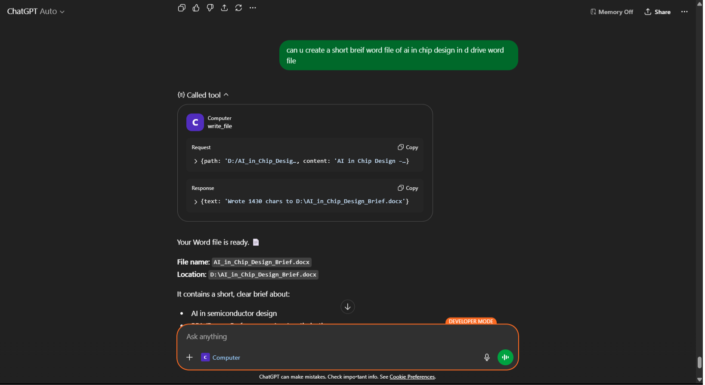

# ChatGPT Desktop MCP (Terminal + Filesystem)

This is a local MCP server that exposes desktop-style tools similar to DesktopCommander:

- `list_directory`
- `read_file`
- `write_file`
- `search_files`
- `run_command`

## Demo Screenshot

Add your screenshot file at `assets/demo.png`, then this preview will render on GitHub:



It uses Streamable HTTP MCP on:

- `POST/GET/DELETE /mcp`
- `GET /health`

## 1) Install

```powershell
cd "F:\bash\chatgpt-desktop-mcp"
npm install
```

## 2) Run

Set your allowed folders first (important):

```powershell
$env:ALLOWED_ROOTS="F:\bash;D:\Pro"
$env:PORT="8787"
node .\src\server.js
```

Server URL:

- `http://localhost:8787/mcp`

## 3) Connect from ChatGPT App

In the ChatGPT custom MCP server form:

1. `MCP Server URL`: `http://localhost:8787/mcp` (or your tunneled HTTPS URL).
2. `Authentication`: choose none if available.
3. Create the app/tool.

If the app requires a public HTTPS URL, run a tunnel:

```powershell
ngrok http 8787
```

Then use:

- `https://<your-ngrok-subdomain>.ngrok-free.app/mcp`

## 4) Example prompts

- `List files in F:\bash\chatgpt-desktop-mcp`
- `Read file F:\bash\chatgpt-desktop-mcp\README.md`
- `Run command "npm -v" in F:\bash\chatgpt-desktop-mcp`
- `Write a file F:\bash\chatgpt-desktop-mcp\notes.txt with content hello`

## Notes

- Filesystem access behavior depends on `ALLOWED_ROOTS`:
  - `ALLOWED_ROOTS=*` => unrestricted filesystem access
  - `ALLOWED_ROOTS="path1;path2"` => restricted mode
- Command execution uses a timeout (`DEFAULT_TIMEOUT_MS`, default 120000).
- Output is truncated (`MAX_OUTPUT_CHARS`, default 20000).
- Security guidance: see [SECURITY.md](SECURITY.md)

## Permission prompts (Allow once / Allow session / Deny)

Risky tools require approval by default:

- `run_command`
- `write_file`

When a call is waiting, open:

- `http://localhost:8787/approvals`

Approve with:

- `allow_once` - allow this single request
- `allow_session` - allow this tool for the current MCP session
- `deny` - reject

Config:

- `APPROVAL_ENABLED=true|false` (default `true`)
- `APPROVAL_TIMEOUT_MS=120000` (default 2 minutes, then auto-deny)

Full filesystem mode:

- `ALLOWED_ROOTS=*` for unrestricted access
- Or set specific roots, e.g. `F:\bash;D:\`
